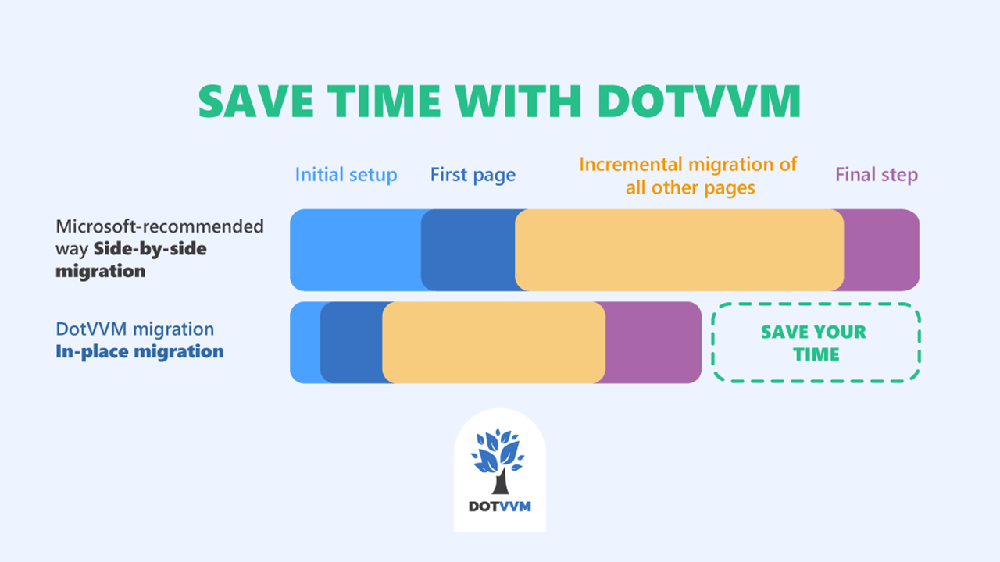

# In-place migration of an old ASP.NET Web Forms app to .NET 7

This repo contains a sample **ASP.NET Web Forms** application and demonstrates the process of **migration to .NET 7** using an open-source framework [DotVVM](https://www.dotvvm.com). 

**[See the video series covering the entire migration process](https://www.youtube.com/playlist?list=PLq1wAETqUjIbZRJn0GjouvDadT3tHU4KV)**

The migration is done **in-place** and most of the business logic will remain unchanged. This approach should be faster than using the side-by-side approach with two applications and YARP.

The migration also shows how to:

* Migrate Entity Framework 6 to Entity Framework Core
* Migrate ASP.NET Membership (ASP.NET Universal Providers) to ASP.NET Core Identity 

The original Web Forms application is called [VtipBaze](https://www.vtipbaze.cz) (database of jokes) and was made by [Michal Altair Valášek](https://www.altair.blog).

## Resources

1. Install the [DotVVM for Visual Studio](https://www.dotvvm.com/get-dotvvm) extension. _Make sure you have installed the latest updates of Visual Studio 2022 - the extension always supports only the latest stable version._

2. Check out the [Cheat-sheet of differences between ASPX and DotHTML syntax](https://www.dotvvm.com/webforms).

3. Checkout the individual branches of this repo to track the progress made in each episode of the [video series](https://www.youtube.com/playlist?list=PLq1wAETqUjIbZRJn0GjouvDadT3tHU4KV). 

4. If you have any questions, join the community at [DotVVM Forum](https://forum.dotvvm.com).

---

## Other resources

* [DotVVM Forum](https://forum.dotvvm.com)
* [DotVVM Official Website](https://www.dotvvm.com)
* [DotVVM Documentation](https://www.dotvvm.com/docs)
* [DotVVM GitHub](https://github.com/riganti/dotvvm)
* [Twitter @dotvvm](https://twitter.com/dotvvm)
* [Samples](https://www.dotvvm.com/samples)
